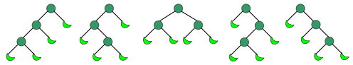
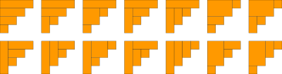

# leetcode

## 3.longest-substring-without-repeating-characters

无重复最长子字符串

如何判断新的字符是否已经在原有的无重复子字符串中是否出现，利用hash表记录位置。

若没有出现，则距离一定大于子字符串的长度。若出现，则距离一定小于等于字符串的长度。

## 5.longest-palindromic-substring

回文字符串，新加入的字符i+1是否构成回文，取决于前一个字符i的所有回文序列。

第三、五题都基于一个假设，当当前的字符串已经处理好想要的结果，如何令再加入一个字符依旧依靠之前的结果得到想要的结果。

**拉马车算法**: 时间复杂度为O(n),空间复杂度为O(n)。

拉马车算法的重点在于可以一次性解决某些字母的最长回文串。

有关拉马车的具体时间复杂度分析还有待考虑，初步计算为2n。

关于拉马车每次移动mx是否是最优的，暂时不知道。

参考链接:<https://segmentfault.com/a/1190000008484167>

```python
p[i]=1
if i < mx:
    p[i] = min(p[2*id-i], mx-i)
# may p[2*id-i]=mx-i or p[i]=1
while(res[i+p[i]]==res[i-p[i]]):
    p[i]+=1
# 维持右边界
if(mx<i+p[i]):
    mx = i+p[i]
    id = i
# 维持max_id
if(p[max_id]<p[i]):
    max_id = i

# len = p[max_id]-1
# start = maxid-p[max_id]//2
# return s[start:start+len]
```

## 6.zig-zag-conversion

之字形，一种是从输入流依次放入输出流，一种是依次遍历输出流，求出输入流的位置。

第一种方法需要借助一个二维列表；第二种方法需要求解公式。

## 8.string-to-integer-atoi

ord(), hex()

32位有符号整数，最小值：0x8000 0000，或者-2**31， 即-2147483648；
最大值：0x7FFFFFFF，或者2**31-1，即2147483647

32位无符号整数，最小值：0x0，即 0；
最大值：0xFFFFFFFF， 即4294967295

re.match() group()  groups() re.search()

## 11.container-with-most-water

最大蓄水问题的证明：<https://blog.csdn.net/kid551/article/details/83094787>

左右两个指针同时夹逼，每次移动最短的边。

属于贪心算法

当取某个最小值并且需要对最小值的位置做进一步处理。6666666

```python
max_area, i, j = max(max_area, h*(j-i)), i+(height[i]==h), j-(height[j]==h)
```

## 15.3-sum

**同一方向的两个指针可以考虑转化为左右两个指针相向而行**.

## 17.letter-combinations-of-a-phone-number

```python
res = reduce(lambda acc, digit: [x+y for x in acc for y in __kvmaps[digit]], digits, [''])

```

## 18.4-sum

```python
findNsum(self, nums, target, N, result, results)
```

result用于记录每次当前的结果，results用于记录当完全成功时的结果，互不影响，互相补充。在22中也用到了。

## 24.swap-nodes-in-pairs

```python
p1.next, p2.next, p3.next = p3, p3.next, p2
p0.next, p1.next, p2.next = p2, p2.next, p1
# or
p2, p3 = p1.next, p1.next.next
p1.next, p2.next, p3.next = p3, p3.next, p2
p1 = p2
```

这里用到的三元素交换巧妙地将每次将p1都放在即将交换的前一位，由三行代码变成了两行

## 29.divide-two-integers

在python中，-7除以3的商和7除以-3比7除以3的商大1.

在c++和java中，-7除以3的商和7除以-3和7除以3的商一致。

## 33.search-in-rotated-sorted-array

在这道题发现自己对于二分法掌握得很不熟练，

对于二分法，

* 循环条件是l<=r
* 循环语句是l=mid+1,r=mid-1
* 结束条件是nums[m]==target

当l和r相差1时，m有两种取法

* m = (l+r)//2，此时m=l，用于寻找相同元素的左边界
* m = (l+r+1)//2，此时m=r，用于寻找相同元素的右边界

```python
# 最基本的
l, r = 0, n-1
while l<=r:
    m = (l+r)//2
    if nums[m] = target:
        break
    if nums[m]<target:
        l=m+1
    else:
        r=m-1
```

```python
# 左右边界
class Solution:
    def searchRange(self, nums: List[int], target: int) -> List[int]:
        if not nums:
            return [-1, -1]
        res = [-1, -1]
        l, r = 0, len(nums)-1
        while l<=r:
            mid = (l+r)//2
            if l==mid and nums[mid]==target:
                res[0]=mid
                break
            if nums[mid]<target:
                l = mid+1
            elif nums[mid]==target:
                r = mid
            else:
                r = mid-1
        l, r = 0, len(nums)-1
        while l<=r:
            mid = (l+r+1)//2
            if r==mid and nums[mid]==target:
                res[1]=mid
                break
            if nums[mid]<target:
                l = mid+1
            elif nums[mid]==target:
                l = mid
            else:
                r = mid-1
        return res
```

```python
# 旋转数组，先判断mid在哪里
class Solution:
    def search(self, nums: List[int], target: int) -> int:
        if not nums:
            return -1
        l, r = 0, len(nums)-1
        while l<=r:
            mid = (l+r)//2
            if nums[mid]==target:
                return mid
            if nums[mid]<=nums[r]:
                if nums[mid]<target<=nums[r]:
                    l = mid+1
                else:
                    r = mid-1
            else:
                if nums[l]<=target<nums[mid]:
                    r = mid-1
                else:
                    l = mid+1
        return -1
```

## 36.valid-sudoku

二维列表转置

```python
matrix = [ [row[col] for row in matrix] for col in range(len(matrix[0]))]
# or
matrix = list(map(list, zip(*matrix)))
```

九宫格

```python
x = 3*(i/3)+j/3
y = 3*(i%3)+j%3
```

三进制表示

```python
# 个位
num%3
# 十位
(num//3)%3
# 百位
(num//3//3)%3
# 对于最后一位，则不需要再次取余
```

## 46.permutations

对于迭代返回二维列表的情况，有两种终止条件，一种是判断是否到了结尾，此时返回的单元素的情况，一种是判断是否出了结尾，此时返回的是空元素的情况。

```python
# method 1.0 单元素的情况
class Solution:
    def permute(self, nums):
        # 空元素视为特殊情况
        if not nums:
            return [[]]
        # 单元素返回一个单元素的二维列表
        if len(nums)==1:
            return [nums]
        res = list()

        for i, val in enumerate(nums):
            for permute in self.permute(nums[:i]+nums[(i+1):]):
                res.append([val]+ permute)
        return res

# method 2.0 空元素的情况
class Solution:
    def permute(self, nums):
        # 空元素时返回一维列表，用or语句使p循环时变成二维列表
        # 或者进行一次判断，使空元素返回一个二维列表
        res = []
        for i, n in enumerate(nums):
            print(i,n)
            for p in self.permute(nums[:i]+nums[(i+1):]) or [[]]:
                print(p)
                res.append([n]+p)
        return res

```

## 48.rotate-image

二维列表的转置

```python
matrix
# v1
res = list(map(list, zip(*matrix)))
# v2
res = zip(*matrix)
# v3
res = [[row[i] for row in A] for i in range(len(A[0]))]
```

二维列表的上下颠倒

```python
res = matrix[::-1]
```

二维列表的左右颠倒

没有找到

二维列表的旋转

```python
# v1
res = zip(*matrix[::-1]) # 上下翻转+转置 # 顺时针旋转
# v2
res = zip(*matrix)[::-1] # 转置+上下翻转 # 逆时针旋转
```

**取反操作**.

```python
# 取反操作
~i = -i-1
# matrix = n*n 中心对称
(i, j)-->(n-i-1, n-j-1)==(-i-1, -j-1)==(~i, ~j)
# 90度对称
(i, j)-->(j, -(i+1))-->(-(i+1), -(j+1))-->(-(j+1), i)-->
(i, j)-->(j, ~i    )-->( ~i   , ~j    )-->(~j    , i)
```

## 54.spiral-matrix

**and** 和 **or**

```python
c = (con1 and con2)
c = (con1 or con2)
```

* and返回最后一个为真的值或者第一个为假的值
* or返回第一个为真的值或者最后一个为假的值

这个特性可以用于递归终止

```python
def fun1(self, matrix):
    return matrix and [*matrix.pop[0]] + self.fun1(matrix)
# 等效于
def fun1(self, matrix):
    if not matrix: # 如果为空，则终止
        return matrix
    res = [*matrix.pop[0]] + self.fun1(matrix)
    return res

```

## 55.jump-game

有的时候我们并不需要记录每一个位置的具体情况，而只需要记录某种情况的边界就足够了，从而将一个列表转换为某种情况的最左(右)边界的位置。

## 60.permutation-sequence

这次主要分析一个关于除法的问题

```python
# 除数为6，希望
# 1-->0..1, 2-->0..2, 3-->0..3,
# 4-->0..4, 5-->0..5, 6-->0..6,
# 并且余数也满足这个规则，依次除下去。
# 两种解决方案
# 第一种
while：
    i, k = divmod(k-1, 6)
    k+=1
# 第二种
k-=1
while:
    i, k = divmod(k, 6)
# 思路：将上述的规则转化为：
# 0-->0..0, 1-->0..1, 2-->0..2,
# 3-->0..3, 4-->0..4, 5-->0..5,
# 并且余数也能满足这个规则，依次除下去
# 只是如果需要当前余数的时候，再加1即可
```

## 64.minimum-path-sum

在这里暴露出的问题是当需要一行res进行存储表示且满足:

```python
# res_table 和 res_row
# res_table中的元素满足
# res_table[i][j]=f(res_table[i-1][j], res_table[i][j-1])
# 此时res_table可以弱化为res_row，且res_table可以分为四类
# 第一类：(0,0)
# 第二类：(0,1), (0,2)...
# 第三类：(1,0), (2,0)...
# 第四类：(1,1),...
# 此时可以通过适当的初始化，将第一类和第三类合并成一类，将第二类和第四类合并成一类，即
# 第一类：(0,0), (1,0), (2,0)...f3:res[j]-->res[j]
# 第二类：(0,1), (0,2), (0,3)...f4:res[j],res[j-1]-->res[j]
# 此时res_row[0]服务于第一类，即f3:res[j]-->res[j]
# res_row[1:]服务于第二类，即f4:res[j],res[j-1]-->res[j]

# 如果上述的合并成两类比较困难，可以采用下面一种方法，代码略多一些，但是更清晰一些

res_row = [0 for _ in range(n)]
# 第一类
res_row[0][0]=f1;
# 第二类
for j in range(1,n):
    res_row[j]=f2:res[j-1]-->res[j]
# 第三类和第四类
for i in range(1,m):
    # 第三类
    res_row[0]=f3:res[j]-->res[j]
    for j in range(1,n):
        # 第四类
        res_row[j]=f4:res[j],res[j-1]-->res[j]
# 齐活
```

## 71.simplify-path

这里犯了逻辑错误

* 遇到 '..' , 如果为空，跳过，如果不为空，弹出；
* 遇到 '', '.', 跳过
* 遇到其他字符， 压入

此时可以合并成

* 遇到 '..' 且不为空， 弹出；(先处理特殊情况'..'且不为空)
* 遇到 '', '.', '..', 跳过；
* 遇到其他字符， 压入

## 77.combinations

这里记录一下递归中返回二维列表的处理方法：

```python
# 异常情况，返回一个空一维列表，在for val_list中会被自动忽略，并一直向上返回一个空列表，一直被忽略
if len(n_list)<k:
    return []
# 正常结束情况，返回一个空二维列表，在for val_list中会被自动添加
if k == 0:
    return [[]]
# 递归返回
res = list()
for i, val in enumerate(n_list):
    for val_list in self.combine_list(n_list[i+1:], k-1):
        res.append([val]+val_list)
return res
```

## 79.word-search

这里进行深度遍历的时候碰到了两个问题：

* 第一个：在成功时如何快速结束： 用 or ，当成功时，后面的都不会进行 
* 第二个：如何判断这个数字是否已经取过： 取过之后变成#，奸诈，在search之后再变回来

```python
class Solution:
    def exist(self, board: List[List[str]], word: str) -> bool:
        m = len(board)
        n = len(board[0])
        word = list(word)
        k = len(word)
        def search(idx, i, j):
            if idx == k:
                return True
            if i<0 or i==m or j<0 or j==n:
                return False
            if word[idx] != board[i][j]:
                return False
            board[i][j]='#'
            res = search(idx+1, i+1, j) or \
                search(idx+1, i, j+1) or \
                search(idx+1, i-1, j) or \
                search(idx+1, i, j-1)
            board[i][j]=word[idx]
            return res
        for x in range(m):
            for y in range(n):
                if search(0, x, y):
                    return True
        return False
```

## 82.remove-duplicates-from-sorted-list-ii

这个递归的思路之前都没有见过，而且处理头指针的方法也不太一样，是直接返回的，而没有用pHead进行标记

```python
class Solution(object):
    def deleteDuplicates(self, head):
        return self.h(head)

    def h(self, head):
        if not head or not head.next: return head
        if head.val != head.next.val:
            head.next = self.h(head.next)
            return head
        x = head.val
        cur = head.next
        while cur and x == cur.val:
            cur = cur.next
        return self.h(cur)
```

```python
class Solution:
    def deleteDuplicates(self, head: ListNode) -> ListNode:
        if not head:
            return head
        cur, is_head = head.next, False
        while cur and cur.val == head.val:
            cur = cur.next
            is_head = True
        head.next = self.deleteDuplicates(cur)
        return head.next if is_head else head
```

## 78, 90 subset

求子集的dfs大法，原理对当前位置的可能性：[], nums[i], nums[i+1], ... nums[-1]

```python
class Solution:
    def subsetsWithDup(self, nums):
        nums.sort()
        res = []
        def dfs(index, path):
            res.append(path)
            for i in range(index, len(nums)):
                if i>0 and nums[i]==nums[i-1]:
                    continue
                dfs(i+1, path+[nums[i]])
        dfs(0, [])
        return res
```

## 91.decode-ways

对于简单地重复从一个序列中依次取出元素做某个操作，可以考虑用reduce和map,

自己在这方面的意识还不是很强

```python
from functools import reduce
class Solution:
    def numDecodings(self, s: str) -> int:
        def func(x1, d):
            v, w, p = x1
            v, w, p = w, (d>'0')*w+(9<int(p+d)<27)*v, d
            return (v, w, p)
        return reduce(func,s,(0,s>'',''))[1]
```

## 92.reverse-linked-list-ii

翻转列表

p3指向当前节点，p2指向前一个节点，为了p3.next指向成功，p4指向后一个节点，为了不被断掉

```python
class Solution:
    def reverseBetween(self, head: ListNode, m: int, n: int) -> ListNode:
        if (not head) or m==n:
            return head
        pHead = ListNode(0)
        pHead.next = head
        p1 = pHead
        for i in range(m-1):
            p1 = p1.next
        p1_prev, p1 = p1, p1.next
        p2, p3, p4 = p1_prev, p1_prev.next, p1_prev.next.next
        for i in range(n-m):
            p2, p3, p4 = p3, p4, p4.next
            p3.next = p2
        p1_prev.next, p1.next = p3, p4
        return pHead.next
```

## 93.restore-ip-addresses

这里有个逻辑判断写的挺好

* 如果a=1，那么可以
* 如果a>1，那么首位不能为0才可以

```python
# 我写出来的逻辑
a==1 or (a!=1 and s[0]!='0')
# 作者写出来的逻辑
a==1 or s[0]!='0'
# 当然在推论上两者是等价的，怎么才能一下子想到这种写法
# 自己应该注意一下这种写法
# 或者说or本身就有否定前者的含义，因此在否定前者的时候，可以不用明确写出
```

## 94.binary-tree-inorder-traversal

这道题涉及到了二叉树遍历的递归和循环两种方法，现在只是有点模糊的递归和循环转换方法。

参考链接:<https://www.cnblogs.com/bjwu/p/9284534.html>

核心思想：

* 栈stack表示cur之前的递归路径，cur表示当前的递归体
* 进入递归表示入栈(cur有值)，返回函数表示出栈(cur=None)
* 可以通过模拟递归的方法来模拟出入栈的思路
* 当前循环体有三种操作：入栈、出栈、操作
* 可以基本证明：如果某次入栈出栈后没有其余多余操作时，总是可以省略的，但是具体的省略方法还没有统一。

**中序遍历**：
递归1：

```python
class Solution:
    def inorderTraversal(self, root: TreeNode) -> List[int]:
        if not root:
            return []
        return self.inorderTraversal(root.left)+[root.val]+self.inorderTraversal(root.right)  
```

递归2：

```python
class Solution:
    def inorderTraversal(self, root: TreeNode) -> List[int]:
        res = list()
        def helper(root):
            if not root:
                return
            helper(root.left)
            res.append(root.val)
            helper(root.right)
        helper(root)
        return res
```

循环:

```python
class Solution:
    def inorderTraversal(self, root: TreeNode) -> List[int]:
        stack = []
        res = []
        cur = root
        while cur or stack:
            if cur:
                stack.append(cur)
                cur = cur.left
            else:
                cur = stack.pop()
                res.append(cur.val)
                cur = cur.right
        return res
```

联想到Morris循环，这里貌似有一些相似，cur为空表示cur的左子树已经遍历结束。算了，不想了，太乱了。

**前序遍历**：
递归：

```python
class Solution:
    def preorderTraversal(self, root: TreeNode) -> List[int]:
        if not root:
            return []
        return [root.val]+self.preorderTraversal(root.left)+self.preorderTraversal(root.right)  
```

循环1：

```python
class Solution:
    def inorderTraversal(self, root: TreeNode) -> List[int]:
        stack = []
        res = []
        cur = root
        while cur or stack:
            if cur:
                res.append(cur.val)
                stack.append(cur)
                cur = cur.left
            else:
                cur = stack.pop()
                cur = cur.right
        return res
```

循环2：我只能说是对的，但是怎么推导过来的不清楚，难道是循环1的精简版？感觉像

刚刚想了想循环2的实现原理，不仅仅是精简版那么简单，更像是因为当前循环体的操作在入栈之前，所以当进入下一个循环体后就没有必要再将当前循环体压入栈中，只要保证下一个循环体返回后，出栈的是应该进入的循环体(即右子节点即可)

```python
class Solution:
    def preorderTraversal(self, root):  ## 前序遍历
        stack = []
        sol = []
        curr = root
        while stack or curr:
            if curr:
                sol.append(curr.val)
                stack.append(curr.right)
                curr = curr.left
            else:
                curr = stack.pop()
        return sol
```

**后序遍历**：
递归：

```python
class Solution:
    def postorderTraversal(self, root: TreeNode) -> List[int]:
        if not root:
            return []
        return self.postorderTraversal(root.left)+self.postorderTraversal(root.right)+[root.val]
```

循环1：

```python
class Solution:
    def postorderTraversal(self, root: TreeNode) -> List[int]:
        res = list()
        stack1 = list()
        stack2 = list()
        cur = root
        while cur or stack1:
            if cur:
                stack1.append(cur)
                stack2.append(0)
                cur = cur.left
            else:
                cur, id = stack1.pop(), stack2.pop()
                if id==0:
                    stack1.append(cur)
                    stack2.append(id+1)
                    cur = cur.right
                elif id == 1:
                    res.append(cur.val)
                    cur = None
```

循环2：好吧，左右中等于中右左，等效于前序遍历，这我无话可说

```python
class Solution:
    def postorderTraversal(self, root: TreeNode) -> List[int]:
        stack = list()
        res = list()
        cur = root
        while stack or cur:
            if cur:
                res.append(cur.val)
                stack.append(cur.left)
                cur = cur.right
            else:
                cur = stack.pop()
        return res[::-1]
```

**层次遍历**：

层次遍历的递归循环转换规则和上述不太一样，不可直接套用

递归： 层次遍历用递归，没想过hhh

```python
class Solution:
    def levelOrder(self, root):
        """
        :type root: TreeNode
        :rtype: List[List[int]]
        """
        def helper(node, level):
            if not node:
                return
            else:
                sol[level-1].append(node.val)
                if len(sol) == level:  # 遍历到新层时，只有最左边的结点使得等式成立
                    sol.append([])
                helper(node.left, level+1)
                helper(node.right, level+1)
        sol = [[]]
        helper(root, 1)
        return sol[:-1]
```

zigzag:

```python
class Solution:
    def levelOrder(self, root):
        """
        :type root: TreeNode
        :rtype: List[List[int]]
        """
        def helper(node, level):
            if not node:
                return
            else:
                if level%2==1:
                    sol[level-1].append(node.val)
                else:
                    sol[level-1].insert(0, node.val)
                if len(sol) == level:  # 遍历到新层时，只有最左边的结点使得等式成立
                    sol.append([])
                helper(node.left, level+1)
                helper(node.right, level+1)
        sol = [[]]
        helper(root, 1)
        return sol[:-1]
```

循环：

```python
class Solution:
    def levelOrder(self, root):
        if not root:
            return []
        sol = []
        curr = root
        queue = [curr]
        while queue:
            curr = queue.pop(0)
            sol.append(curr.val)
            if curr.left:
                queue.append(curr.left)
            if curr.right:
                queue.append(curr.right)
        return sol
```

zigzag:

```python
class Solution:
    def levelOrder(self, root):
        if not root:
            return []
        sol = []
        curr = root
        stack1 = [curr]
        stack2 = []
        while stack1 or stack2:
            if stack1:
                cur = stack1.pop()
                sol.append(cur.val)
                if cur.left:
                    stack2.append(cur.left)
                if cur.right:
                    stack2.append(cur.right)
            else:
                cur = stack2.pop()
                sol.append(cur.val)
                if cur.right:
                    stack2.append(cur.right)
                if cur.left:
                    stack2.append(cur.left)
        return sol
```

**Morris Traversal**:非递归，不用栈，O(1)空间复杂度，核心思想是怎么找到下一个输出的结点

二叉树递归遍历的实质是，只要这个节点不为空，那么这个节点一定会遍历3次，先序中序后续只不过是打印的时机不同。先序是第一次到达这个节点，中序是第二次，后序是第三次。Morris遍历高度模仿这个过程。Morris遍历，如果这个节点有左子树，那么能到达这个节点两次，没有左子树，只能到达这个节点一次。

<http://www.cnblogs.com/AnnieKim/archive/2013/06/15/MorrisTraversal.html>

```python
# tree
#        1
#      /   \
#     2      3
#   /   \  /   \
#  4    5  6    7
```

**中序遍历**：

* 如果cur的左孩子为空，输出cur并cur=cur.right
* 如果cur的左孩子不为空，则找到cur的前驱结点pre(一定在左子树中)
* * 如果前驱结点pre的右孩子为空，则pre.right = cur,cur = cur.left
* * 如果前驱结点的右孩子为当前节点pre.right==cur，则pre.right=None,输出cur，cur=cur.right

中序遍历的方法：a)当左子树不为空且没有被访问时，遍历左子树，设置cur的前驱结点为左子树的尾节点,左子树遍历之后cur指向左子树的尾节点，当左子树为空或者已经被访问(pre.right==cur)时，遍历右子树cur=cur.right，右子树遍历之后cur指向右子树的尾节点;b)并且当左子树为空或者已经被访问(pre.right==cur)时，输出cur

公式:$f(T(1))=f(T(2))+T(2)->1+f(T(3))$

其中f定义为root的中序输出，T(2)->1时(左子树为空或者已经被访问)输出cur

```python
class Solution:
    def inorderTraversal(self, root: TreeNode) -> List[int]:
        cur = root
        res = list()
        while cur:
            if not cur.left:
                res.append(cur.val)
                cur = cur.right
            else:
                pre = cur.left
                while pre.right and pre.right!=cur:
                    pre = pre.right
                if not pre.right:
                    pre.right = cur
                    cur = cur.left
                else:
                    res.append(cur.val)
                    pre.right = None
                    cur = cur.right
        return res
```

时间复杂度分析：O(n)，n个点，n-1条边，点最多访问两次(while cur)，边最多访问两次(while pre.right and pre.right!=cur)

**前序遍历**：

核心分析与中序遍历类似，令cur.right指向下一个要访问的结点

* 如果cur.left为空，则输出cur并cur=cur.right
* 如果cur.left不为空，找到左子树的前驱结点pre
* * 如果pre.right为空，则pre.right=cur，输出cur，cur=cur.left
* * 如果pre.right不为空，则pre.right=None, cur=cur.right

前序遍历：a)当左子树不为空且没有被访问时，遍历左子树，设置cur的前驱结点为左子树的尾节点，左子树遍历之后的cur指向左子树的尾节点，当左子树为空或者已经被访问(pre.right==cur)时，遍历右子树cur=cur.right，右子树遍历之后cur指向右子树的尾节点;b)并且当左子树为空或者没有被访问(pre.right==None)时，输出cur

公式:$f(T(1))=T(2)->1+f(T(2))+f(T(3))$

其中f定义为root的前序输出，T(2)->1(当左子树为空或者没有被访问)输出cur

```python
class Solution:
    def preorderTraversal(self, root: TreeNode) -> List[int]:
        cur = root
        res = list()
        while cur:
            if not cur.left:
                res.append(cur.val)
                cur = cur.right
            else:
                pre = cur.left
                while pre.right and pre.right!=cur:
                    pre = pre.right
                if not pre.right:
                    res.append(cur.val)
                    pre.right = cur
                    cur = cur.left
                else:
                    pre.right = None
                    cur = cur.right
        return res
```

**后序遍历**：

后序遍历有点坑啊，公式总结了两天才得到

* 建立临时结点dump，令其左孩子是root
* 如果cur的左孩子为空，cur=cur.right
* 如果cur的左孩子不为空，则找到cur的前驱结点pre(一定在左子树中)
* * 如果前驱结点pre的右孩子为空，则pre.right = cur,cur = cur.left
* * 如果前驱结点的右孩子为当前节点pre.right==cur，则pre.right=None,倒序输出从cur.left到pre的所有结点(即cur.left 一路right到pre)

后序遍历的方法：a)当左子树不为空且没有被访问时，遍历左子树，设置cur的前驱结点为左子树的尾节点，左子树遍历之后cur指向左子树的尾节点，当左子树为空或者已经被访问(pre.right==cur)时，遍历右子树cur=cur.right，右子树遍历之后cur指向右子树的尾节点;b)当cur的左子树遍历之后，倒序输出cur.left到pre的结点

后序遍历的输出

公式:$f(T(0))=f(T(1))+f(T(3))+f(T(7))+T(7)-->0$

其中f定义为root的左子树的后序输出，T(7)-->0时倒序输出，可以简单证明这种方法是正确的。

```python
class Solution:
    def postorderTraversal(self, root: TreeNode) -> List[int]:
        dump = TreeNode(0)
        dump.left = root
        cur = dump
        res = list()
        def reverse(begin, end):
            res_tmp = list()
            cur_tmp = begin
            while begin!=end:
                res_tmp.append(begin.val)
                begin = begin.right
            res_tmp = res_tmp[::-1]
            return res_tmp
        while cur:
            if not cur.left:
                cur = cur.right
            else:
                pre = cur.left
                while pre.right and pre.right!=cur:
                    pre = pre.right
                if not pre.right:
                    pre.right = cur
                    cur = cur.left
                else:
                    res.extend(reverse(cur.left, pre))
                    pre.right = None
                    cur = cur.right
        return res
```

同时可以看到中序、前序、后序三种输出方式的cur的转移方式是一样的，不一样的是何时以哪种方式输出。

* 中序: 左子树为空或者已经被遍历，输出cur
* 前序: 左子树为空或者还没有被遍历，输出cur
* 后序: 左子树已经被遍历，倒序输出cur.left--pre

## 95.unique-binary-search-trees-ii

二叉搜索树：中序遍历是有序的

## 96.unique-binary-search-trees

感觉到了这里，已经不能用简单的递归之类的算法来解决了，都或多或少地涉及到一些额外的知识。

**卡特兰数**：

参考链接:<https://blog.csdn.net/wookaikaiko/article/details/81105031>

1, 1, 2, 5, 14, 42, 132

实在总结不出来就看前三项是否满足1,1,2,5或者1,2,5这样的顺序

公式：$h(n)=C$

$$h(0)=1, h(1)=1$$
$$h(n)=h(0)h(n-1)+h(1)h(n-2)+...+h(n-1)h(0) (n>=2)$$
或者
$$h(n)=C(2n,n)-C(2n,n+1) (n=0,1,...)$$
或者
$$h(n)=\frac{C(2n,n)}{n+1}$$
或者
$$h(n)=\frac{1}{n+1}*\sum_{i=0}^n(C_n^i)^2$$
或者
$$h(n+1)=\frac{2(2n+1)}{n+2}h(n)$$

**规律1，进出栈形式** 根据格子和5元10元问题，暂时可以发现这两道题的一个规律进出栈，a) 起终都是为空(到中线/没有5元)b) 中间过程中有值时，两个操作AB都可以进行(向左或者右走/5元或者10元)， c) 中间过程中为空(即到中线/没有5元)时，只能执行操作A(向右走/5元)，d)先操作A后操作B等效于空

**规律2，相互独立形式** 是根据三角形划分等问题得到的，n个点，确定点j后，问题可以划分为两个相互独立的子问题(j-1个点和n-j-1个点)，并且j的取值范围是0->n-1.

应用：

**进出栈问题**：进栈序列为1,2,3,...,n时有多少个不同的出栈序列？

定义h(n)是n个数字的不同的出栈序列个数。假设k是最后一个出栈的数字，那么比k早进早出栈的有k-1个数，即出栈的前k-1个数的集合为{1,2,...,k-1}，比k晚进早出栈的有n-k个数，即出栈序列的后n-k个数的集合是{k+1,k+2,...,n}，所以此时总体出栈序列为{1,2,...,k-1},{k+1,k+2,...,n},k,且前半段和后半段相互独立，k可以从1取到n，所以有$h(n)=h(0)h(n-1)+h(1)h(n-2)+...+h(n-1)h(0)$

**进出栈问题的变种**：n个人拿5元、n个人拿10元买物品，物品5元，老板没零钱，问有几种排队方式。可以将其转换为拿5元的人表示入栈，拿10元的人表示出栈，所以排队顺序就等于出栈顺序，即h(n)种，又因为n个人不同，有n种排列，所以总排队方式有h(n)n!n!种。

**n个不同结点的二叉搜索树或者n个相同结点的二叉树构成问题**：n个结点1~n，一共可以构成几种二叉搜索树。

如果采用中序遍历的话，假设根节点第k个被访问，则根节点的左子树有k-1个结点，即集合{1,2...k-1}，右子树有n-k个结点，即集合{k+1,...,n}，且互相独立。

n个不同结点的二叉搜索树和n个相同结点的二叉树是一一对应的，只要令二叉树的中序遍历的结点重新从小到大赋值，就是n个不同结点的二叉搜索树。

**凸多边形的三角形划分**：一个凸的n边形，用直线连接他的两个顶点使之分成多个三角形，每条直线不能相交，问一共有多少种划分方案。


选择一条基边，假设是p1-pn，再选择另外一个点pi做一个三角形，那么除了中间的三角形之外，K2是i边多边形，K1是n-i+1边多边形，i的取值范围是2到n-1，所以C(n)=C(2)C(n-1)+...C(n-1)C(2)，令h(n)=C(n+2)，所以h(n)=h(0)h(n-1)+h(1)h(n-2)+...+h(n-1)h(0)，且C(n)=h(n-2)

**n+1个叶子结点的满二叉树(国外定义，度或者为0，或者为2)的个数**：等于n个相同结点的二叉树

事实上，向左记为+1，向右记为−1，按照向左优先的原则，从根节点开始遍历．例如第一个图记为+1,+1,+1,−1,−1,−1,于是由卡特兰数的含义可得满二叉树的个数为Cn。



**nxn格子的走法**：nxn格子中，只能下三角行走，每次横走或者竖走一格，有多少种走法？


令向右走相当于进栈，向左走相当于出栈。

至于这样的规律是否一定可以满足出入栈的解法，还有待验证。

**凸n+2边形区域分成三角区域的方法<=>n+1个叶子结点的满二叉树的类型<=>n+1个数连乘的乘法顺序**.

**引理1**：由n对括号形成的合法括号表达式的个数为h(n).

这个n对括号等同于刚刚满二叉树的+1和-1记为左括号和右括号。

这个有点复杂，写不清楚，就直接套用作者的话吧


**引理2**：n+1个数连乘，不同的乘法顺序数为h(n)。

凸n+2边形转化为n+1个数字的乘法顺序


**圆上2n个点的连接方法**：在圆上选择2n个点,将这些点成对连接起来使得所得到的n条线段不相交的方法数？和凸包切割一个原理


那里不是减号，而是等于号。

**n个长方形填充阶梯图**：n个长方形填充一个高度为n的阶梯状图形的方法个数？把包含左上角的矩形去掉，就很容易由递推公式二推得所有填充方法数就是卡特兰数。



## 105 & 106 construct-binary-tree-from-inorder-and-postorder-traversal

在有中序遍历的情况下，前序/后序遍历的作用是一样的，每次弹出的结点都是当前树的根节点。

```python
# 105
class Solution:
    def buildTree(self, preorder: List[int], inorder: List[int]) -> TreeNode:
        if not inorder:
            return 
        ind = inorder.index(preorder.pop(0))
        root = TreeNode(inorder[ind])
        root.left = self.buildTree(preorder, inorder[:ind])
        root.right = self.buildTree(preorder, inorder[ind+1:])
        return root

# 106
class Solution:
    def buildTree(self, inorder: List[int], postorder: List[int]) -> TreeNode:
        if not inorder or not postorder:
            return None
        ind = inorder.index(postorder.pop())
        root = TreeNode(inorder[ind])
        root.right= self.buildTree(inorder[ind+1:], postorder)
        root.left = self.buildTree(inorder[:ind], postorder)
        return root
```

## 109.convert-sorted-list-to-binary-search-tree

平衡二叉搜索树的链表等于中序遍历，或者说，给定一个中序遍历，怎么得到二叉树。

```python
class Solution:
    def sortedListToBST(self, head: ListNode) -> TreeNode:
        r = -1
        node = head
        while node:
            r+=1
            node = node.next
        node = head
        def Lrt2BST(l, r):
            # 空 结束条件
            nonlocal head
            if l>r:
                return None
            mid = (l+r)//2
            left = Lrt2BST(l, mid-1)
            root = TreeNode(head.val)
            head = head.next
            right = Lrt2BST(mid+1, r)
            root.left = left
            root.right = right
            return root
        root = Lrt2BST(0, r)
        return root
```